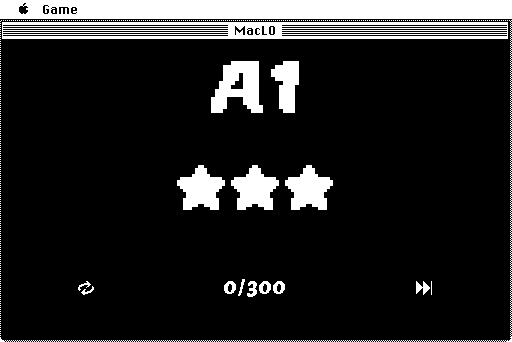

# MacLO #

MacLO is a clone of the puzzle game [Lights Out](https://en.wikipedia.org/wiki/Lights_Out_(game)) for the 68k Macintosh. It is a port of [ArduLO](https://github.com/jonthysell/ArduLO) for the Arduboy.

MacLO is B&W and 32-bit clean. It requires at least a Mac Plus running System 6.0.8, but will also work on newer machines up to Mac OS 9.2.2.

## Build ##

To build MacLO from source, you'll need a working [THINK C 5.0](https://macintoshgarden.org/apps/think-c) development environment. This can be done in an emulator such as [Mini vMac](https://www.gryphel.com/c/minivmac/) or on real hardware.

## Play ##

MacLO contains two sets of 50 puzzles. At the title screen you can select either Set A or Set B with the mouse to start the game. You can also toggle sound on and off.

The objective is to turn off all of the lights in as few moves as possible. Clicking a light will cause it and the nearby lights to toggle in the shape of a plus.

After finshing a puzzle, you'll be given a score in one to three stars. Here you can either move on to the next puzzle or retry for a better score. Try to get three stars on all 50 levels in each set!

## Errata ##

MacLO is open-source under the MIT license.

Copyright (c) 2021 Jon Thysell
